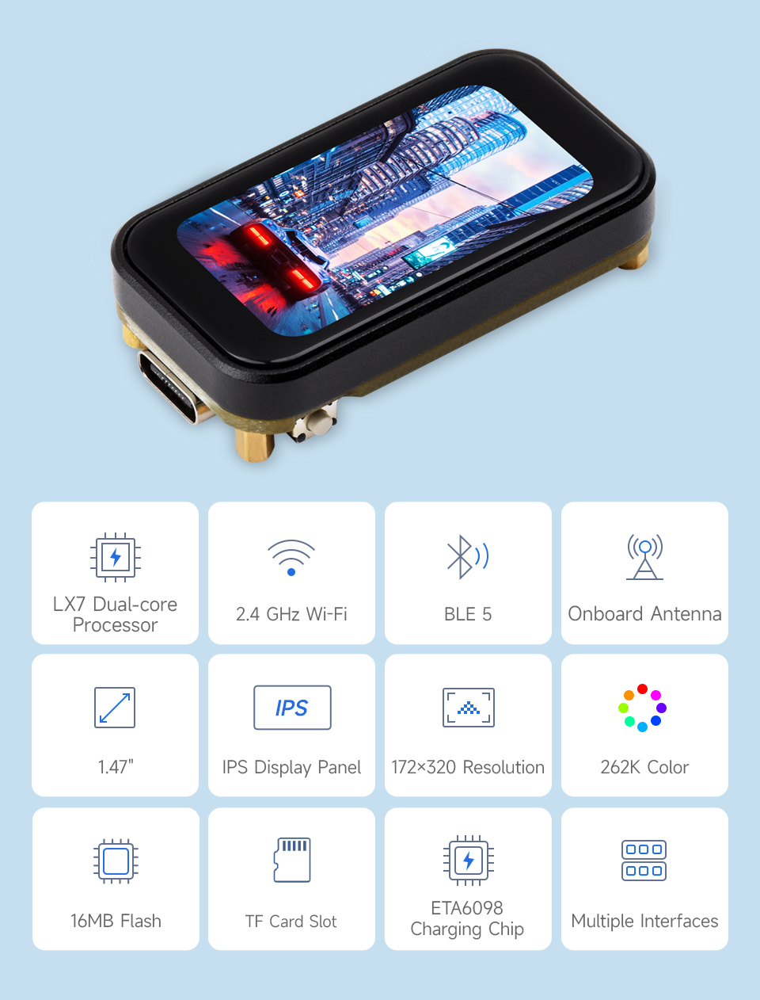
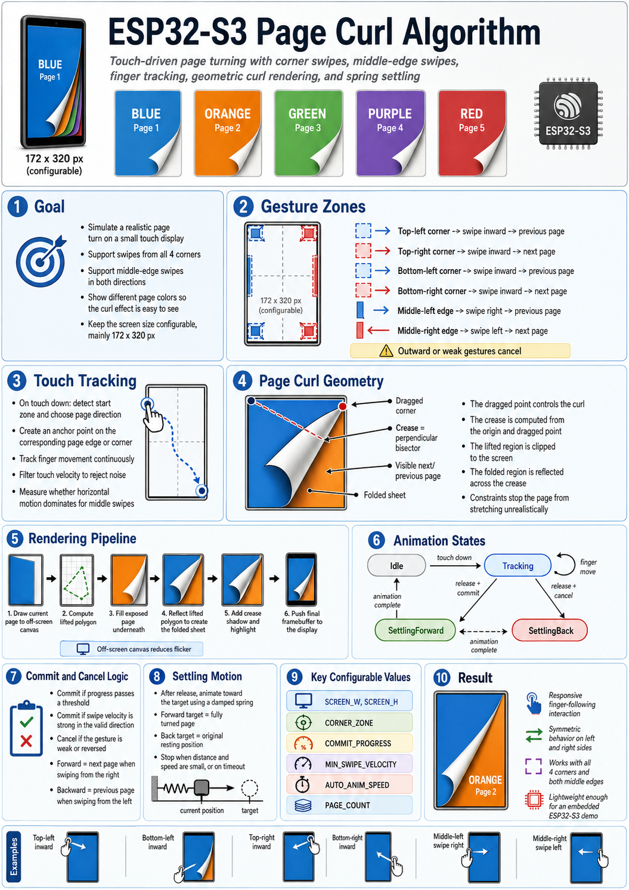

# Hexagonal Bubble Menu Demo

Apple Watch-style honeycomb launcher for the [Waveshare ESP32-S3 Touch LCD 1.47"](https://www.waveshare.com/esp32-s3-touch-lcd-1.47.htm).



## How It Works



## Features

- **50 colored bubbles** in a staggered hex grid layout
- **Pan & inertia** – drag to scroll, flick for momentum
- **Three-zone focus model** – rounded-rectangle regions (Center / Fringe / Outer) scale bubbles from 14px to 20px
- **Position compaction** – growing bubbles pull toward screen center to avoid overlap
- **Tap to expand** – bubble animates to fill the screen
- **Swipe to close** – drag ≥ 80px shrinks back to the original bubble; short swipes spring back
- **Spring-back** – idle cluster returns to screen center unless it covers ≥ 50% of the display

## Hardware

| Component | Details |
|-----------|---------|
| Board | ESP32-S3 (8MB PSRAM, 240MHz dual-core) |
| Display | 172×320 ST7789/JD9853 via SPI |
| Touch | AXS5106L capacitive over I2C |

## Build & Flash

```bash
# Requires PlatformIO CLI
pio run -d hexagonal-bubble-menu-demo --target upload --upload-port COM6
```

## Project Structure

```
src/
  config/config.h    – Vec2, pin defs, screen geometry, tuning constants, bubble colors
  hw/display.{h,cpp} – ST7789/JD9853 SPI init + register sequence
  hw/touch.{h,cpp}   – AXS5106L I2C touch driver
  menu/menu.{h,cpp}  – state machine, hex layout, projection, touch handling, animation
  render/renderer.{h,cpp} – off-screen canvas rendering, frame dispatch
  main.cpp           – setup, touch polling, main loop
```
